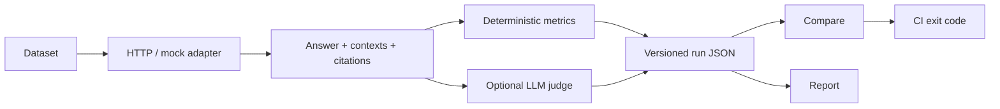

# ragproof — RAG evaluation and regression gates

[](https://github.com/however-yir/ragproof/actions/workflows/ci.yml)
[](https://however-yir.github.io/ragproof/)
[](https://github.com/however-yir/ragproof/actions/workflows/codeql.yml)
[](https://github.com/however-yir/ragproof/releases)
[](https://www.python.org/)
[](LICENSE)

> A framework-agnostic Python CLI that calls your RAG API, records comparable evidence, computes retrieval and citation metrics, and fails CI when quality regresses.
>
> 框架无关的 RAG 评测 CLI：调用你的 RAG API，保存可比较证据，计算检索与引用指标，并在质量退化时让 CI 失败。

[Documentation](https://however-yir.github.io/ragproof/) · [30-second quickstart](https://however-yir.github.io/ragproof/QUICKSTART/) · [Public benchmark](https://however-yir.github.io/ragproof/BENCHMARK/) · [Adapter guide](https://however-yir.github.io/ragproof/ADAPTERS/) · [Issues](https://github.com/however-yir/ragproof/issues) · [Discussions](https://github.com/however-yir/ragproof/discussions)

RAG systems often keep returning HTTP 200 after a prompt, chunking, retriever, or model change—even when answer quality quietly gets worse. `ragproof` turns that silent failure into a versioned run, an explainable report, and a merge-blocking exit code.

<p align="center">
  
</p>

> The GIF records an offline mock workflow. It demonstrates the CLI, not production RAG quality. The evidence below comes from the separate HTTP benchmark.

## Run a gate in 30 seconds

```bash
# Requires Python 3.10 or newer; install the latest verified release tag
python -m pip install "git+https://github.com/however-yir/ragproof.git@v0.4.1"

# Create a self-contained offline starter project
mkdir ragproof-demo && cd ragproof-demo
ragproof init ragproof.yaml
ragproof run -c ragproof.yaml -o current.json

# Exercise the same exit-code path used in CI
ragproof compare \
  --baseline current.json \
  --current current.json \
  --max "error_rate<=0.0"

ragproof report current.json -o report.html --open
```

`init` creates both a starter config and dataset. Baseline and current are deliberately the same in this smoke test: that verifies the CLI, artifact reader, report, and exit code, but it is **not** a quality benchmark. For a real gate, commit a reviewed baseline and compare later runs against it.

The distribution name is `ragproof-cli`; the import package and command remain `ragproof`. The PyPI project named `ragproof` is unrelated—do **not** run `pip install ragproof`. Until the `ragproof-cli` Trusted Publisher is active, use the fixed Git tag above.

## Reproducible HTTP contract benchmark

The repository includes a deterministic benchmark that travels through the real generic HTTP adapter instead of the in-process mock:

| Evidence | Committed result |
|---|---:|
| CC0 synthetic corpus | 75 documents |
| English and Chinese questions | 60 |
| Answerable / unanswerable | 55 / 5 |
| `recall@3` / `mrr` / `ndcg@3` | 1.000 / 1.000 / 1.000 |
| `citation_validity` / `citation_recall` | 1.000 / 1.000 |
| `unanswerable_correctness` / `error_rate` | 1.000 / 0.000 |
| Negative controls | shuffled ranking and missing citations must fail |

Context, citation, and answerable-sample retrieval-metric coverage are 55/60 (91.7%) by design because five deliberately unanswerable samples return no context or citation.

**Interpretation boundary:** this synthetic benchmark validates HTTP mapping, metrics, citations, provenance, reporting, and CI failure behavior. It does not measure production RAG quality or compare model vendors. See the [current generated report](https://however-yir.github.io/ragproof/PUBLIC_BENCHMARK_REPORT/), [method and limitations](docs/BENCHMARK.md), [known-good baseline](examples/baselines/public-http-p1.json), and [negative-control CI](.github/workflows/ci.yml).

## How it works



The run artifact is the stable interchange format. It records schema version, dataset/config/sample fingerprints, field and metric coverage, aggregates, group slices, and per-sample evidence so compare and report do not need to call the RAG service again.

## When ragproof fits

| Choose ragproof when… | Choose a broader tool when… |
|---|---|
| You test an already deployed RAG HTTP API from the outside. | You need deep in-process pipeline instrumentation or agent trajectory tracing. |
| A small Python CLI and deterministic CI exit code are the main contract. | You need a hosted annotation, observability, or team experiment platform. |
| Provenance, coverage, baseline/delta, group, and citation gates matter. | You primarily need large model/provider matrices or automated red teaming. |
| Evaluation data and reports should remain local unless your configured endpoints receive them. | You want automatic test generation as the central workflow. |

Deterministic metrics and the mock workflow require no model. Optional judge metrics support an OpenAI-compatible endpoint; a locally operated Ollama endpoint is possible, but Ollama and the selected model must be installed and running separately.

## Honest positioning

These projects overlap; `ragproof` is intentionally narrower, not universally better.

| Tool | Official focus | Prefer it when… |
|---|---|---|
| **ragproof** | External RAG API contract, comparable run artifacts, provenance/coverage, and CI regression gates | You want a focused Python CLI that turns an existing RAG endpoint into a reproducible merge rule. |
| [Ragas](https://docs.ragas.io/) | LLM application metrics, test generation, experiments, and framework integrations | You need Python-centric evaluation research, dataset generation, or a broader metrics ecosystem. |
| [promptfoo](https://www.promptfoo.dev/docs/) | General LLM evaluation, provider/model comparison, Web Viewer, CI/CD, and red teaming | You need prompt/provider matrices, UI sharing, or security testing beyond a focused RAG gate. |

No speed, accuracy, or resource-use benchmark against these tools is claimed here.

## Capabilities

| Area | What is included |
|---|---|
| **Adapters** | Generic HTTP mapping, LangServe/LangChain, LlamaIndex, Dify, OpenAI-compatible presets, mock mode, plugin entry points, SSE multi-event mapping, probe-assisted setup |
| **Retrieval** | recall/precision/hit-rate, MRR, graded NDCG/MAP, negative-hit rate, rank sensitivity, ID normalization |
| **Answers and citations** | exact match, lexical token F1, refusal/unanswerable checks, claim support, citation validity/precision/recall/span overlap |
| **Optional judge** | faithfulness, groundedness, hallucination rate, context relevance, answer relevancy, cache, voting, calibration, concurrency and prompt limits |
| **Regression policy** | absolute floors, lower-is-better maxima, delta, relative drop, group gates, sample-count and coverage requirements, YAML policy |
| **Artifacts** | versioned JSON/JSONL, HTML, Markdown, CSV, JUnit XML, SARIF, provenance fingerprints and recursive redaction |
| **Data quality** | JSONL/NDJSON/JSON/CSV/XLSX/Parquet input, lint, manifests, stratified sampling, near-duplicate detection |
| **Operations** | native async HTTP, bounded concurrency, retry policy, response limits, atomic writes, Python 3.10–3.13 and macOS/Windows smoke tests |

## Evaluate a real RAG API

Map your request and response fields in YAML:

```yaml
name: my-rag-eval
dataset: dataset.jsonl

adapter:
  type: http
  base_url: https://rag.example.invalid
  endpoint: /query
  method: POST
  bearer_token_env: RAG_API_TOKEN
  json_field: question
  answer_path: data.answer
  contexts_path: data.contexts
  context_id_path: id
  citations_path: data.citations

top_ks: [3, 5, 10]
concurrency: 4
redact_sensitive: true
```

Then run and gate it:

```bash
ragproof validate -c ragproof.yaml
ragproof run -c ragproof.yaml -o runs/current.json
ragproof compare \
  --baseline runs/baseline.json \
  --current runs/current.json \
  --threshold "recall@5=0.70" \
  --threshold "citation_coverage=0.80" \
  --max-relative-drop "citation_coverage=5%"
ragproof report runs/current.json -o runs/report.html
```

Use `ragproof probe` for an unfamiliar safe test endpoint. It prints candidate field paths and latency without printing headers or response content. See the searchable [adapter guide](https://however-yir.github.io/ragproof/ADAPTERS/), [CLI reference](https://however-yir.github.io/ragproof/CLI_REFERENCE/), and [run schema](https://however-yir.github.io/ragproof/SCHEMA_REFERENCE/).

## Dataset

The minimal UTF-8 JSONL sample has a stable ID and question. Retrieval and citation gold labels are optional:

```json
{"id":"q-001","question":"什么是 RAG？","ground_truths":["检索增强生成。"],"relevance_scores":{"doc-rag":3,"doc-intro":1},"expected_citations":["doc-rag"],"tags":["zh","intro"],"answerable":true}
```

Read the [dataset reference](https://however-yir.github.io/ragproof/DATASET_SCHEMA/) for graded qrels, negatives, slices, answerability, and metadata.

## CI gate

```yaml
- name: RAG regression gate
  run: |
    ragproof compare \
      --baseline runs/baseline.json \
      --current runs/current.json \
      --threshold "recall@5=0.70" \
      --group-threshold "tags:zh:recall@5=0.70" \
      --require-field contexts
```

The bundled composite Action adds reports, artifacts, outputs, and annotations. Pin a release tag for normal use or a full commit SHA for security-sensitive workflows. See the [CI tutorial](https://however-yir.github.io/ragproof/CI_TUTORIAL/).

## Reports

```bash
ragproof report runs/current.json -o report.html
ragproof report runs/current.json -o report.md
ragproof report runs/current.json -o report.csv
ragproof report runs/current.json -o report.xml
ragproof report runs/current.json -o report.sarif
```


> This screenshot is a mock-generated UI example. It is not benchmark evidence.

## Documentation and project status

- [Documentation site](https://however-yir.github.io/ragproof/)
- [Architecture](https://however-yir.github.io/ragproof/ARCHITECTURE/)
- [Python extension API](https://however-yir.github.io/ragproof/API_REFERENCE/)
- [Run artifact schema](https://however-yir.github.io/ragproof/SCHEMA_REFERENCE/)
- [Roadmap](ROADMAP.md)
- [Changelog](CHANGELOG.md)
- [Contributing](CONTRIBUTING.md)
- [Security policy](SECURITY.md)

PyPI publication remains opt-in until the `ragproof-cli` Trusted Publisher is bound and verified. Tag releases already build and smoke-test wheel/sdist artifacts, generate an SBOM and SHA256 checksums, and create a GitHub provenance attestation.

## Development

```bash
python3 -m venv .venv
source .venv/bin/activate
python -m pip install -e ".[dev,docs]"
pytest -q
ruff check ragproof tests
mypy ragproof
mkdocs build --strict
```

## License

MIT © [however-yir](https://github.com/however-yir)
