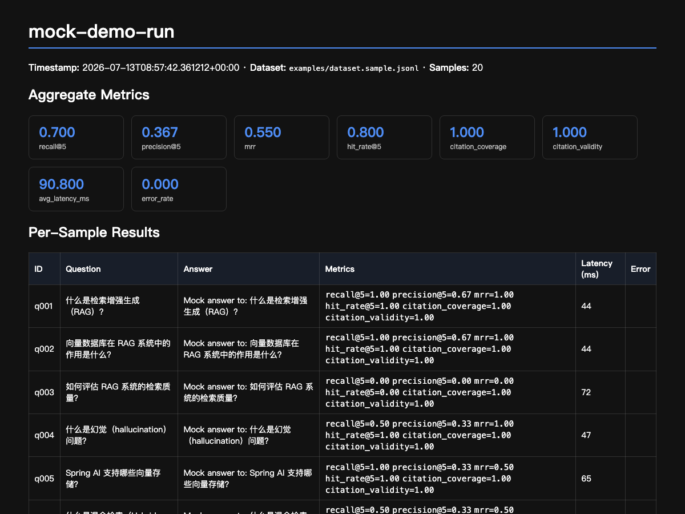

# ragproof — RAG 评测与回归测试 CLI | RAG Evaluation & Regression Testing

[](https://github.com/however-yir/ragproof/actions/workflows/ci.yml)
[](https://www.python.org/)
[](LICENSE)

> **一句话**：框架无关的 RAG 质量评测工具。喂数据集 → 调你的 RAG API → 算指标 → 出报告 → CI 卡红线。
>
> **One line**: A framework-agnostic RAG evaluation harness. Feed a dataset → call your RAG API → compute metrics → render a report → gate CI on regressions.

RAG 系统最大的风险不是"跑不起来"，而是"改了一个 prompt、换了一个 chunk 策略、升级了一个模型之后，质量悄悄下降却没人知道"。`ragproof` 把 RAG 质量变成**可度量、可比较、可在 CI 中卡红线**的一等公民。

The hardest part of shipping RAG is not getting it to run — it is knowing that a prompt tweak, a chunking change, or a model upgrade silently degraded quality. `ragproof` makes RAG quality **measurable, comparable, and enforceable in CI**.

---



## Features

| 能力 | 说明 |
|---|---|
| **确定性检索指标** | `recall@k` / `precision@k` / `MRR` / `hit_rate@k` — 不依赖任何 LLM，稳定可复现 |
| **引用溯源指标** | `citation_coverage`（有上下文时是否给出引用）/ `citation_validity`（引用是否指向真实检索结果） |
| **LLM-as-judge** | `faithfulness`（答案是否被上下文支撑 / 幻觉检测）/ `answer_relevancy`（答案是否切题），任何 OpenAI 兼容端点均可，**本地 Ollama 开箱即用** |
| **回归门禁** | `ragproof compare` 对比 baseline 与 current，阈值不达标 exit code = 1，直接卡住 CI |
| **报告** | 一条命令生成 Markdown / HTML 报告 |
| **框架无关** | 通用 HTTP adapter，通过 YAML 声明请求/响应字段映射即可接入任何 RAG API（Spring AI / LangChain / LlamaIndex / 自研均可） |
| **优雅降级** | Judge 端点不可用时自动跳过 LLM 指标，确定性指标照常输出 |

## Quick Start

```bash
pip install -e .   # 从源码安装 (PyPI 发布在 roadmap 中)
```

**30 秒离线体验**（mock adapter，无需任何 RAG 系统或模型）：

```bash
ragproof run -c examples/mock.yaml -o runs/current.json
ragproof report runs/current.json -o report.html
open report.html
```

**评测真实系统**：

```bash
# 1. 声明你的 RAG API 怎么调、字段怎么映射（见 examples/knowledgeops.yaml）
ragproof run -c examples/knowledgeops.yaml -o runs/current.json

# 2. 与 baseline 对比，阈值不达标则 exit 1
ragproof compare \
  --baseline runs/baseline.json \
  --current  runs/current.json \
  --threshold "recall@5=0.70" \
  --threshold "faithfulness=0.75"

# 3. 生成报告
ragproof report runs/current.json -o report.html
```

## How It Works

```
dataset.jsonl ──▶ adapter (HTTP/mock) ──▶ your RAG API
                        │
                        ▼
              answer + contexts + citations
                        │
        ┌───────────────┼────────────────┐
        ▼               ▼                ▼
  retrieval metrics  citation metrics  LLM-as-judge
  (recall@k, MRR…)   (coverage, valid) (faithfulness…)
        └───────────────┼────────────────┘
                        ▼
                 runs/current.json
                   │           │
                   ▼           ▼
          ragproof compare   ragproof report
          (CI gate, exit 1)  (Markdown / HTML)
```

## Dataset Format

每行一个 JSON（JSONL）：

```json
{"id": "q001", "question": "什么是 RAG？", "ground_truth": "RAG 是...", "relevant_doc_ids": ["doc1", "doc2"]}
```

- `ground_truth` — 供 `answer_relevancy` judge 参考（可空）
- `relevant_doc_ids` — 供 `recall@k` / `MRR` 等检索指标使用（可空，为空时该指标记 N/A）

## Configuration

```yaml
name: my-rag-eval
dataset: examples/dataset.sample.jsonl

adapter:
  type: http
  base_url: http://localhost:8080
  endpoint: /ai/pdf/chat
  method: POST
  headers:
    X-API-Key: "${KNOWLEDGEOPS_API_KEY}"   # 支持 ${ENV_VAR} 展开
  json_field: message                       # 问题放进 JSON body 的哪个字段
  answer_path: data.answer                  # 从响应里取答案的 dotted path
  contexts_path: data.contexts              # 检索上下文列表
  context_id_path: docId                    # 每个上下文条目的 id 字段
  citations_path: data.citations            # 引用列表

judge:
  base_url: http://localhost:11434/v1       # Ollama / 任何 OpenAI 兼容端点
  model: qwen2.5:7b
  skip_on_error: true                       # judge 不可用时跳过而非失败

top_k: 5
concurrency: 4
```

完整示例：[examples/knowledgeops.yaml](examples/knowledgeops.yaml)（对接 [knowledgeops-agent](https://github.com/however-yir/knowledgeops-agent)）、[examples/mock.yaml](examples/mock.yaml)（离线演示）。

## CI Gate

在 GitHub Actions 中把 eval 变成 PR 门禁 —— prompt / 检索策略改动导致指标跌破阈值时，PR 直接红：

```yaml
- name: Regression gate
  run: |
    ragproof compare \
      --baseline runs/baseline.json \
      --current  runs/current.json \
      --threshold "recall@5=0.70" \
      --threshold "faithfulness=0.75" \
      --threshold "citation_coverage=0.80"
```

完整流水线示例：[examples/github-actions.yml](examples/github-actions.yml)。

## Metrics Reference

| Metric | Type | 含义 |
|---|---|---|
| `recall@k` | deterministic | 相关文档在 top-k 检索结果中的召回比例 |
| `precision@k` | deterministic | top-k 检索结果中相关文档的占比 |
| `mrr` | deterministic | 第一个相关文档排名的倒数 |
| `hit_rate@k` | deterministic | top-k 中是否命中任一相关文档 |
| `citation_coverage` | deterministic | 检索到上下文时答案是否给出引用 |
| `citation_validity` | deterministic | 引用指向真实检索结果的比例 |
| `faithfulness` | LLM-as-judge | 答案声明被上下文支撑的程度（幻觉检测），0–1 |
| `answer_relevancy` | LLM-as-judge | 答案对问题的切题程度，0–1 |
| `avg_latency_ms` / `error_rate` | operational | 平均延迟 / 请求错误率 |

## Sample Report

仓库内置一份用 mock adapter 跑出的示例（截图见文首）：[docs/sample-report.md](docs/sample-report.md)（HTML 版见 [docs/sample-report.html](docs/sample-report.html)）。

## Development

```bash
python3 -m venv .venv && source .venv/bin/activate
pip install -e ".[dev]"
pytest
```

## Roadmap

- [ ] PyPI 发布
- [ ] LLM judge 结果缓存（相同 answer+contexts 不重复打分）
- [ ] `compare` 支持相对回归阈值（如 "较 baseline 下降不超过 5%"）
- [ ] 更多内置 adapter 预设（LangServe / OpenAI Assistants / Dify）
- [ ] 多 run 趋势报告

## Why Another Eval Tool?

相比 ragas / promptfoo 等优秀工具，`ragproof` 刻意保持**小而专**：

1. **面向"已部署的 RAG API"** 而非 Python 进程内 pipeline —— 你只需要一个 HTTP 端点，不需要用特定框架重写检索逻辑；
2. **回归门禁是一等公民** —— `compare` + exit code 天生为 CI 设计；
3. **零重依赖** —— 只有 httpx / pydantic / click / jinja2 / pyyaml，安装秒级完成；
4. **local-first** —— judge 默认指向 Ollama，无 API key 也能完整体验。

## License

MIT © [however-yir](https://github.com/however-yir)
