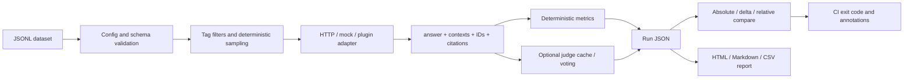

# Architecture

The run JSON is the stable interchange format. It intentionally records the package version, Git SHA, configuration summary, dataset size, timings, metric aggregates, group aggregates, and per-sample evidence so a later report can be rendered without re-running the RAG service. The top-level `schema_version` is migrated on read, and the packaged contract is published at [`ragproof/schemas/run.schema.json`](../ragproof/schemas/run.schema.json).
