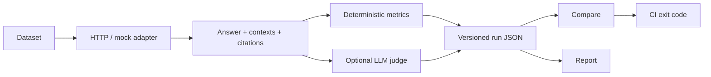

# Catch RAG regressions before users do

`ragproof` is a framework-agnostic Python CLI that calls a deployed RAG API, records versioned evidence, computes retrieval and citation metrics, and turns quality thresholds into CI exit codes.

It is designed for a common failure mode: a prompt, chunking, retriever, or model change still returns HTTP 200 while answer quality quietly gets worse.

[Run the offline quickstart](QUICKSTART.md){ .md-button .md-button--primary }
[Inspect the public benchmark](BENCHMARK.md){ .md-button }
[Configure an adapter](ADAPTERS.md){ .md-button }

_The recording uses the deterministic mock adapter to demonstrate the CLI workflow. The evidence below comes from the separate public HTTP benchmark._

## Reproducible HTTP contract benchmark

The repository ships a known-good baseline produced through the real generic HTTP adapter, not the in-process mock. The corpus, questions, service, configuration, hashes, and negative controls are all checked in and run without a model or external network call. The summary below is regenerated from the same current run as the full published report.

--8<-- "includes/public-benchmark-summary.inc"

Two separate negative controls prove that shuffled ranking and missing citations fail their intended gates.

!!! important "What these numbers mean"
    This synthetic, deterministic benchmark validates adapter mapping, metrics, citations, provenance, and CI failure behavior. It does **not** measure production RAG quality or compare model vendors.

[Open the current full report](PUBLIC_BENCHMARK_REPORT.md) · [Read the method and limitations](BENCHMARK.md) · [Inspect the committed baseline](https://github.com/however-yir/ragproof/blob/main/examples/baselines/public-http-p1.json)

## From API response to merge gate

## Where to go next

- **New user:** finish the [30-second quickstart](QUICKSTART.md), then replace the mock adapter with your API.
- **Integration author:** use the [adapter guide](ADAPTERS.md) and [Python extension API](API_REFERENCE.md).
- **Dataset owner:** follow the [dataset schema](DATASET_SCHEMA.md) and benchmark manifest rules.
- **CI maintainer:** configure [absolute, delta, relative, group, and coverage gates](CI_TUTORIAL.md).
- **Artifact consumer:** validate the [versioned run schema](SCHEMA_REFERENCE.md).

## Scope by design

`ragproof` fits best when a deployed RAG endpoint must be tested from the outside and a reproducible CI decision matters. It is intentionally smaller than broad LLM experiment, red-team, observability, or hosted annotation platforms. Deterministic metrics require no model; optional judge metrics can use an OpenAI-compatible endpoint, including a locally operated one.
